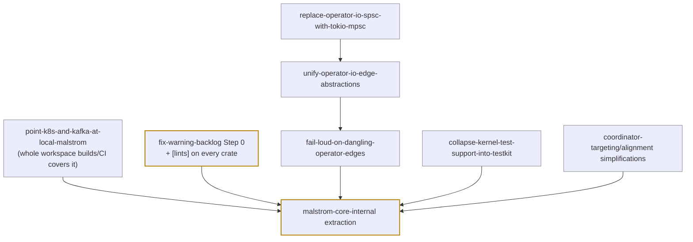

# Agent Note: Split `malstrom-core-internal` out of the kernel

Status: proposed

## Problem

`malstrom-core` has two audiences and one `pub` surface that serves both — see
[`docs/overviews/08-public-api-surface.md`](../../../../docs/overviews/08-public-api-surface.md)
for the full inventory. Concretely:

- The **facade** (`malstrom/src/lib.rs`) does
  `pub use malstrom_core::{channels, coordinator, runtime, snapshot, stream, types, worker}` —
  it re-exports every core module verbatim, so the sibling-facing surface is also the
  user-facing surface. A user can name `malstrom::channels::spsc::Receiver`,
  `malstrom::stream::Forward`, `malstrom::channels::alignment::AlignmentGroup`, and
  `malstrom::worker::InnerRuntimeBuilder`.
- The **sibling layer crates** (`malstrom-distributed`, `malstrom-operators`,
  `malstrom-testkit`, `malstrom-snapshot-slatedb`) depend on `malstrom-core` directly and reach
  into deep paths for edge plumbing: `channels::spsc`, `channels::alignment`,
  `channels::recv_trait`, `stream::{OperatorBuilder, Forward}`, `runtime::communication`,
  `types::distributed`, and (none actually use it) `worker::InnerRuntimeBuilder`.

Rust has only `pub` and `pub(crate)`, so "visible to sibling crates but not to users" cannot be
expressed inside one crate. Today the only things kept off the public surface are marked
`pub(crate)` (`channels::signal`, `runtime::runtime_flavor`, `coordinator::{messages, cluster,
watchmap}`), and every sibling-needed item is forced to full `pub` — which the facade then
re-exports by default.

`#[doc(hidden)]` is a partial, unenforced workaround; a separate crate is the compiler-enforced
boundary. The question this note settles is whether that crate is worth the restructuring cost.

## Proposal

Introduce a **`malstrom-core-internal`** crate holding the kernel implementation details that
sibling crates legitimately need but users should never see. `malstrom-core` depends on it;
siblings depend on it (and on `malstrom-core`); the facade never re-exports it.

```
malstrom-core-internal   (no facade exposure)
        ▲        ▲
        │        │
malstrom-core   malstrom-{distributed,operators,testkit,snapshot-slatedb}
        ▲        ▲
        └── malstrom (facade) ──► users
```

- **What moves.** The candidate set is exactly the sibling-only surface from the audit:
  `channels::spsc`, `channels::alignment`, `channels::recv_trait`, `stream::Forward`,
  `stream::OperatorBuilder` (and possibly `stream::Operator`), `runtime::communication`, and
  `types::distributed` — *subject to the cycle constraint below*.
- **What stays.** The user extension API: `stream::{Logic, SafeLogic, LogicBuilder,
  StreamBuilder, OperatorContext, BuildContext}`, `channels::operator_io::{Input, Output}`,
  `types` (model types), `runtime::{SingleThreadRuntime, MultiThreadRuntime, RuntimeFlavor}`,
  `snapshot::*`, `worker::{Worker, WorkerBuilder, StreamProvider}`, `coordinator::*`.
- **Dependency direction.** `malstrom-core` re-exports the internal crate's items where they
  must remain reachable (e.g. `channels::operator_io` itself needs `spsc`), so existing
  `malstrom_core::...` paths keep resolving for the siblings during the migration. The facade
  stops at `malstrom-core`, so nothing internal reaches users.

### The cycle constraint (must be resolved first)

`Message` — a **user-visible** type in `malstrom-core::types` — embeds the keyed
state-movement protocol types:

```rust
// malstrom-core/src/types/message.rs
Message::Interrogate(Interrogate<..>) | Collect(Collect<..>) | Acquire(Acquire<..>)
```

`Acquire`/`Collect`/`Interrogate` live in `types::distributed` and are the wire vocabulary
`malstrom-distributed` builds on. They **cannot** move to `malstrom-core-internal` while
`Message` stays in `malstrom-core` without inverting the dependency (core → internal is fine;
but `Message` embedding them means either `Message` moves too, or the types stay in core).

Options, in order of preference:

1. **Leave `types::distributed` in `malstrom-core` and only `#[doc(hidden)]` it** (not a full
   move). It is genuinely part of the kernel's wire vocabulary; the audit's complaint is
   visibility, not location.
2. **Move both `Message` and `types::distributed` to `malstrom-core-internal`**, re-exporting
   `Message` (and the three structs) from `malstrom-core` for users. Keeps the boundary clean
   but puts a user-visible type behind the internal crate.
3. **Keep the status quo for this group** and accept `types::distributed` as unavoidably public
   (matching the audit's "open question").

This note proposes **option 1** for the protocol types and reserves the crate move for the
items with no user reason to exist at all (`spsc`, `alignment`, `recv_trait`, `Forward`,
`OperatorBuilder`, `runtime::communication`, `InnerRuntimeBuilder`).

## Ordering / prerequisites

The extraction should move **final** types, not types that are about to be rewritten. Four
proposed notes already reshape or depend on the crate graph and the items on the move list;
landing them first makes the extraction a move of stable code instead of churn on top of
churn. Two more are cheap prerequisites for reasons outside the crate graph.



| Before (proposed note) | Why it must precede | State (2026-09-21) |
|---|---|---|
| [replace-operator-io-spsc-with-tokio-mpsc](2026-09-13-replace-operator-io-spsc-with-tokio-mpsc.md) | owns the edge-channel semantics (`Option<T>` vs `pending`, `SendError`); the thing to move should be final | todo |
| [unify-operator-io-edge-abstractions](2026-09-13-unify-operator-io-edge-abstractions.md) | **reshapes `spsc`, `recv_trait`, `alignment`** — three moved items; move the unified interface, not the old one | todo |
| [fail-loud-on-dangling-operator-edges](2026-09-19-fail-loud-on-dangling-operator-edges.md) | adds a sender-gone signal to `spsc` and build-time graph validation; depends on the two above | todo |
| [collapse-kernel-test-support-into-testkit](../../proposed/testing/2026-09-16-collapse-kernel-test-support-into-testkit.md) | deletes the kernel's `test-support` feature and self-dev-dep; the extraction changes how siblings depend on core — do it with two crates, not three | todo |
| [point-k8s-and-kafka-at-local-malstrom](../../proposed/process/2026-08-22-point-k8s-and-kafka-at-local-malstrom.md) | `malstrom-k8s/runtime` and `malstrom-kafka` still pin the published crates.io `malstrom 0.1.0`; a crate-graph change is invisible to them until they build locally | todo |
| [fix-warning-backlog](../../proposed/process/2026-08-25-fix-warning-backlog.md) (Step 0) | sets `[workspace.lints]` and requires `[lints] workspace = true` on every crate; the new crate should inherit the final config | **in progress** — Steps 1–3 done, Step 4 open |

**Progress (2026-09-21).**

- The extraction's **safe subset** (the cycle-free, relation-free items) has already shipped:
  `worker::InnerRuntimeBuilder` and `Output`/`Input::add_another_one` → `pub(crate)`;
  `stream::Forward`/`OperatorBuilder` doc-hidden; `Operator::input`/`output` → `pub(crate)`.
  The crate move itself (`spsc`/`alignment`/`recv_trait`/`runtime::communication`) still awaits
  the prerequisites below.
- [fix-warning-backlog](../../proposed/process/2026-08-25-fix-warning-backlog.md) is the one
  prerequisite being advanced: Step 0 (explicit `allow` list + widened gate) landed, Steps 1–3
  (unused lints, mechanical clippy lints, `missing_docs`) are done, Step 4 (judgment lints)
  remains.
- All other prerequisites are untouched.

**Cheap, not prerequisites (do the simple edit before freezing the type):**
[coordinator-targeting-and-alignment-simplifications](../../proposed/simplification/2026-08-30-coordinator-targeting-and-alignment-simplifications.md)
touches `alignment`; landing it first means the moved type is simpler.

**Independent (either order):** the source-lifecycle notes
([first-class-source-discovery-message](2026-08-24-first-class-source-discovery-message.md),
[frontier-merge-source-completion](2026-08-24-frontier-merge-source-completion.md),
[safelogic-source-coordinator](2026-08-24-safelogic-source-coordinator.md),
[source-discovery-wire-message](2026-08-24-source-discovery-wire-message.md)) reshape
`SourceCoordinator`/`Message`/`WireMessage`, not the moved edge internals — and `Message` /
`types::distributed` stay in core under this proposal. They are orthogonal to the extraction
(`source-discovery-wire-message` depends on the k8s/kafka note, not on this one).

If any prerequisite is deferred indefinitely, the safe subset remains: move only the
cycle-free, relation-free items first (`stream::Forward`, `stream::OperatorBuilder`,
`worker::InnerRuntimeBuilder`), which are touched by none of the notes above.

## Migration steps

1. **Create the crate skeleton** — `malstrom-core-internal/Cargo.toml` (workspace lint opt-in,
   same metadata as the other crates) with an empty `lib.rs`.
2. **Move the no-cycle items first**: `channels::spsc`, `channels::alignment`,
   `channels::recv_trait`, `stream::Forward`, `stream::OperatorBuilder`,
   `runtime::communication`. Update `malstrom-core` and the sibling crates to import from
   `malstrom_core_internal::…`.
3. ~~**Make `InnerRuntimeBuilder` `pub(crate)`**~~ — **done 2026-09-21** (with
   `StreamBuilder::runtime` and the unused `get_runtime` removed). Also done from the audit's
   safe subset: `stream::Forward`/`OperatorBuilder` doc-hidden, `Operator::input`/`output`
   `pub(crate)`, `Output`/`Input::add_another_one` `pub(crate)`.
4. **Re-export during transition** where `operator_io`/`stream` need the moved items
   (`pub use malstrom_core_internal::channels::{spsc, alignment, recv_trait}` under
   `#[doc(hidden)]`), then drop the re-exports once siblings import the new crate directly.
5. **Stop the facade re-exporting internal modules** — finalise the curated
   `malstrom` surface (task 5 of the audit).
6. **Add a public-API gate** — `cargo-public-api` snapshot on `malstrom-core` (and the facade)
   so a re-leak of an internal item fails CI.

## Alternatives considered

- **`#[doc(hidden)]` on the internal items, no new crate** — cheapest, no dependency changes.
  But it is **not enforced**: a user can still name the items, and the facade still re-exports
  the modules. Fixes only the documentation view. Kept as the interim mechanism for
  `types::distributed` (cycle-bound) and as a stopgap during migration.
- **A feature-gated `internal-api` module in `malstrom-core`** — e.g.
  `#[cfg(feature = "internal-api")] pub mod internal { … }`, enabled by each sibling. Real
  compiler enforcement of "only with the feature", one crate, no new dependency edge. Costs a
  feature and cfg noise, and features are additive/unify across the graph — a sibling enabling
  it does not stop a user from enabling it too. Weaker than a crate but lighter.
- **Curate the `malstrom` facade only** — leave core's `pub` tree alone and hand-pick what the
  facade re-exports. Fixes the *user* view with no restructuring, but core's own surface stays
  flat and the sibling/user distinction remains implicit. This is a strict subset of the goal
  and can land first.
- **Move all siblings into one workspace crate with `pub(crate)` internals** — collapses the
  layer boundaries the split deliberately created; rejected.
- **Do nothing** — the audit's status quo: users inherit the sibling surface, `Forward` and
  `spsc` become accidental compatibility surface.

## Acceptance criteria

- `malstrom-core-internal` exists and holds the agreed sibling-only items; `malstrom-core` and
  the sibling crates build against it.
- `malstrom` (facade) no longer re-exports any internal module: none of `spsc`, `alignment`,
  `recv_trait`, `Forward`, `OperatorBuilder`, `runtime::communication`, `InnerRuntimeBuilder`
  appear under `malstrom::…`.
- `cargo-public-api` (or an equivalent `cargo doc` JSON diff) pins the intended user surface of
  `malstrom-core` and the facade, and fails when an internal item leaks into it.
- `cargo test --workspace` and `RUSTDOCFLAGS="-D warnings" cargo doc --workspace --no-deps` stay
  green; no intra-doc link points at a moved item.
- The `types::distributed` / `Message` coupling is resolved explicitly (option 1 above:
  stay + `#[doc(hidden)]`), documented in the note.

## Risks

- **Churn and cycles.** Moving `spsc`/`alignment`/`recv_trait` touches `operator_io`,
  `stream_builder`, the distributed routers, and testkit mocks; a missed `pub use` breaks the
  sibling builds. Land it in the small steps above, verifying `cargo check` per step.
- **Re-export spillover.** A transitional `pub use` from `malstrom-core` re-opens the same leak;
  the re-exports must be `#[doc(hidden)]` and removed, not left as the endpoint.
- **The cycle is a trap.** Attempting to move `types::distributed` first — before resolving
  `Message` — inverts the dependency and will not compile. Sequence matters.
- **Cost vs. benefit.** This is a multi-crate restructuring to shrink an API that is currently
  *used by exactly four in-repo crates*. If the project does not intend to publish and version
  the kernel API, the payoff is smaller; the `#[doc(hidden)]` + curated-facade subset may be
  enough.
- **Interaction with the edge work.** The
  [unify-operator-io-edge-abstractions](2026-09-13-unify-operator-io-edge-abstractions.md) and
  [replace-operator-io-spsc-with-tokio-mpsc](2026-09-13-replace-operator-io-spsc-with-tokio-mpsc.md)
  notes are already reshaping `spsc`/`recv_trait`. Do **not** move those items before those
  decisions land, or the move is churn on top of churn. `Forward`/`OperatorBuilder`/
  `InnerRuntimeBuilder` are cycle-free and relation-free — move those first.

## Related

- [`docs/overviews/08-public-api-surface.md`](../../../../docs/overviews/08-public-api-surface.md)
  — the audit this note acts on (module inventory, audience matrix, hide list).
- [stream-builder-union-refactor](../../implemented/architecture/2026-09-14-stream-builder-union-refactor.md)
  — created `OperatorBuilder` and the public `Forward`, two of the items to hide.
- [unify-operator-io-edge-abstractions](2026-09-13-unify-operator-io-edge-abstractions.md) and
  [replace-operator-io-spsc-with-tokio-mpsc](2026-09-13-replace-operator-io-spsc-with-tokio-mpsc.md)
  — own the edge layer (`spsc`, `recv_trait`) whose move this note must not race.
- [split-malstrom-core](../../implemented/architecture/2026-08-24-split-malstrom-core.md) — the
  crate split whose "kernel is a first-class crate" decision this note extends with an internal
  boundary.