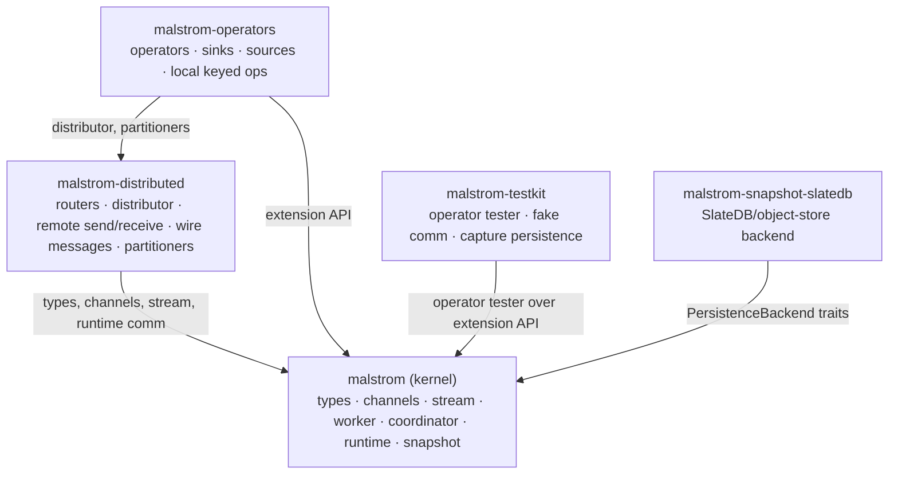
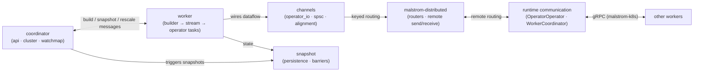

# Malstrom — Module & Crate Map

> **Last refreshed:** 2026-08-24 (split-malstrom-core: `malstrom-core` split into kernel +
> `malstrom-distributed` + `malstrom-operators` + `malstrom-testkit` + `malstrom-snapshot-slatedb`)
> **Scope:** how the workspace crates and the kernel's `malstrom-core/src/*` modules connect
> **Method:** comment-stripped scan of every `crate::` reference (incl. multi-line `use crate::{…}` blocks)
> over the reachable source tree.

## The crate layout (layered, acyclic)

**`malstrom` (facade, `malstrom/`)** — the public entry point: re-exports
`malstrom-core`'s kernel modules (`types`, `channels`, `stream`, `worker`, `coordinator`,
`runtime`, `snapshot`) and `malstrom-operators`' `operators`/`sinks`/`sources`/`keyed`, plus
the SlateDB backend under feature `slatedb`. No logic of its own; depends on the layers.

**`malstrom-core` (kernel, `malstrom-core/`)** — the execution engine. Modules: `types`,
`channels`, `stream`, `worker`, `coordinator`, `runtime`, `snapshot`. Depends on nothing in
the workspace.
The kernel owns the **public operator extension API** (`stream::{Logic, SafeLogic,
SafeLogicWrapper, BuildContext, OperatorContext, StreamBuilder}`, `channels::operator_io`,
the `Message`/`Kvt` vocabulary) and the protocol message types
(`types::distributed::{Acquire, Collect, Interrogate}`).

**`malstrom-distributed`** — the keyed routing protocol: routers, distributor,
`remote_receiver`/`remote_sender`, wire/versioned/targeted messages, `worker_partitioners`.
Depends only on `malstrom-core`.

**`malstrom-operators`** — the stdlib: `operators`, `sinks` (incl. `VecSink`), `sources`
(incl. the `fn_source` constructors and the source engine), and the local keyed ops
(`key_local`, `key_distribute`, `broadcast`), plus a `keyed::distributed` shim re-exporting
`malstrom-distributed` at the historical path. Depends on `malstrom-core` + `malstrom-distributed`.

**`malstrom-testkit`** — the operator tester, in-memory comm backends and capture persistence,
used by downstream crates' unit tests. Depends on `malstrom-core`.

**`malstrom-snapshot-slatedb`** — the SlateDB/object-store `PersistenceBackend` connector.
Depends on `malstrom-core`.

**`malstrom-kafka`, `malstrom-k8s/*`, `malstrom-macros`** — connectors/runtime/macros, as before.

## Kernel module layers (inside `malstrom-core/src/*`)

**L0 — Foundation · `types`** — keys, values, timestamps, `Message`/`Kvt`, `WorkerId`,
partitioners, `distributable` (wire encoding), and the state-movement protocol messages
(`types::distributed`). Every module depends on it.

**L1 — Primitives · `channels` + `snapshot`** — `channels` is the data-movement layer
(`operator_io` `Input`/`Output`/`link`, `spsc`, `alignment` barrier alignment, `signal`,
`recv_trait`); `snapshot` holds the persistence traits (`PersistenceBackend`/
`PersistenceClient`), `SnapshotBarrier`, snapshot versions. Note `channels → snapshot`: the
barrier that flows inside `Message` lives here.

**L2 — Assembly API · `stream`** — the dataflow builder: `Malstrom`/`StreamBuilder`/
`InitialStreamBuilder`, the `Operator` and `Logic` traits, `BuildContext`/`OperatorContext`.
This is the seam where everything meets: `Logic`'s IO is expressed in terms of
`channels::operator_io::{Input, Output}`, `types::distributed` control messages, and
`snapshot::SnapshotBarrier`.

**L3 — Execution core · `runtime` + `worker` + `coordinator`** — `runtime` (communication
backends and flavors, `threaded` single/multi-thread runtimes, `RuntimeFlavor`), `worker`
(the unit of parallelism: `WorkerBuilder`, `Worker`, `CoordinationTask`, `RootLogic`/
`StreamProvider`), `coordinator` (job lifecycle: `api`, `cluster`, `watchmap`, `messages`,
`snapshot`). These three form the execution-core cycle: `runtime` constructs both `worker`
and `coordinator`; worker↔coordinator exchange messages over runtime comm.

## Dependency diagram (crates)

> **Caption:** the facade depends on the layers, nothing depends on the facade — the graph
> is acyclic by construction. `malstrom-operators` keeps a `keyed::distributed` shim so the
> historical import path still resolves through the facade. `malstrom-operators` keeps a `keyed::distributed` shim module so
> the historical import path still resolves.

## How the pieces connect at runtime

One job = one coordinator + N identical workers (parallelism). The worker builds the dataflow
(`stream` + `malstrom-operators` operators) and executes operator tasks; operators exchange
`Message`s through `channels`; `malstrom-distributed` routes messages to the right local
operator or, via `runtime` communication, to a remote worker; the coordinator drives
build/snapshot/rescale by sending messages that travel the same comm paths; snapshot barriers
flow in-band inside `Message` and state is flushed through `snapshot::PersistenceClient`.

## Cycles & smells worth knowing

- **Execution-core cycle** `worker ↔ coordinator ↔ runtime`: by design — the threaded runtime
  constructs both actors, which then talk over runtime comm.
- **`types` points upward** (`types → stream/snapshot`): the core `Message` type knows about
  the state-movement protocol messages (`types::distributed`) and snapshot barriers. The
  router machinery that moves them now lives in `malstrom-distributed`; only the message
  vocabulary stays in the kernel.
- **Barrier lives in `snapshot` but flows through `types` and `channels`**: snapshot
  coordination is woven into the message stream (this is what enables exactly-once barriers).
- **`malstrom-operators`' `keyed::distributed` shim** exists so `crate::keyed::distributed`
  paths in the operator layer keep resolving; it is a thin re-export of `malstrom-distributed`.
- **Kernel manifest is lean**: `expiremap`, `rand`, `eyre`, `console-subscriber` and the
  slatedb/object-store/tokio-stream stack left the kernel with the extracted crates.
