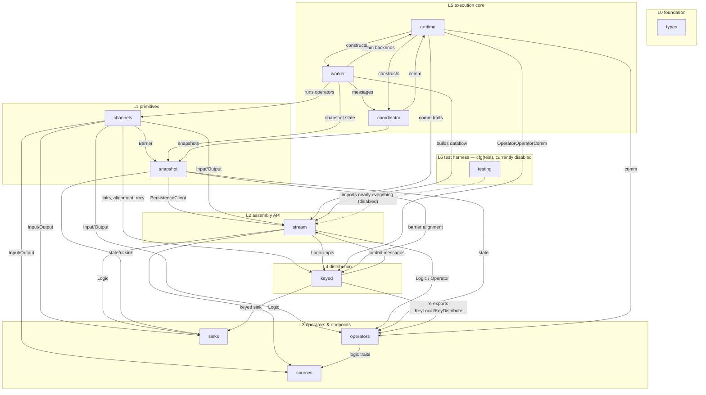
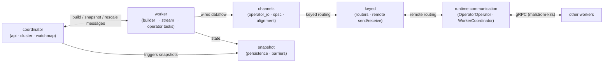

# Malstrom Core — Module Map

> **Last refreshed:** 2026-08-23 (new-scheduler @ a4c8fce; dead reference files deleted in `collapse-source-traits`)
> **Scope:** how the top-level modules of `malstrom-core/src/*` connect to each other
> **Method:** comment-stripped scan of every `crate::` reference (incl. multi-line `use crate::{…}` blocks)
> over the **reachable** source tree; the dead reference files (`keyed_old/`, `*_old.rs`,
> `operator_io copy.rs`, `testing/iterator_source.rs`) are deleted.
> ~104 reachable files across 12 top-level modules.

## Ground-up: the layers

**L0 — Foundation · `types`** (8 files)
Keys, values, timestamps, `Message`/`Kvt`, `WorkerId`, partitioners, `distributable` (wire encoding). **Every module depends on it** — it is the shared vocabulary.

**L1 — Primitives · `channels` (6) + `snapshot` (2)**
- `channels` — the data-movement layer: `operator_io` (`Input`/`Output`/`link`), `spsc`, `alignment` (barrier alignment), `signal`, `recv_trait`.
- `snapshot` — persistence backends (`NoPersistence`, SlateDB/object-store), `SnapshotBarrier`, snapshot versions. Depends only on `types` (+ externals). Note `channels → snapshot`: the barrier that flows inside `Message` lives here.

**L2 — Assembly API · `stream`** (6)
The dataflow builder: `Malstrom`/`StreamBuilder`/`InitialStreamBuilder`, the `Operator` and `Logic` traits, `BuildContext`/`OperatorContext`. This is the seam where everything meets: `Logic`'s IO is expressed in terms of `channels::operator_io::{Input, Output}`, `keyed::distributed::{Acquire, Collect, Interrogate}` control messages, and `snapshot::SnapshotBarrier`.

**L3 — Operators & endpoints · `operators` (21) + `sources` (4) + `sinks` (5)**
- `operators` — the built-in library (`map`, `filter`, `split`, `stateful_map`, `ttl_map`, `union`, time operators, …), each implementing `stream::Logic` and moving data via `channels`.
- `sources`/`sinks` — endpoints that implement the same `Logic` traits; stateful variants use `snapshot` state and `keyed` partitioning.

**L4 — Distribution · `keyed`** (20)
Key distribution across workers: `key_local`, `key_distribute`, `broadcast`, `worker_partitioners`, and the `distributed` submodule (routers, `remote_receiver`/`remote_sender`, wire messages). Heaviest user of `channels` (10 files) and `stream` (8) — keyed operators *are* stream operators with remote routing.

**L5 — Execution core · `runtime` (14) + `worker` (7) + `coordinator` (7)**
- `runtime` — communication backends and flavors: `runtime::communication` (traits + request/response/stream plumbing), `runtime::threaded` (in-process `Single`/`MultiThreadRuntime`), `RuntimeFlavor` (distributed gRPC flavor lives in `malstrom-k8s`).
- `worker` — the unit of parallelism: `WorkerBuilder` builds the dataflow (`stream_builder`), `Worker` runs operator tasks on `tokio::LocalRuntime`, `CoordinationTask` talks to the coordinator, `RootLogic`/`StreamProvider` glue.
- `coordinator` — job lifecycle: `api`, `cluster` (cluster handle), `watchmap`, `messages`, `snapshot`.
- These three form a **cycle**: `runtime` constructs both `worker` and `coordinator`; worker↔coordinator exchange messages over runtime comm.

**L6 — Test harness · `testing`** (5)
`operator_tester`, `iterator_source`, `communication`, `VecSink`. `cfg(test)` only — **currently disabled** in `lib.rs`.

## Dependency diagram

> **Caption:** arrows into `types` are omitted — *every* module depends on it. `testing` is drawn
> once; it imports all layers but is `cfg(test)` and currently not compiled.

## How the pieces connect at runtime

One job = one coordinator + N identical workers (parallelism). The worker builds the dataflow
(`stream`/`operators`) and executes operator tasks; operators exchange `Message`s through
`channels`; `keyed` routes messages to the right local operator or, via `runtime`
communication, to a remote worker; the coordinator drives build/snapshot/rescale by sending
messages that travel the same comm paths; snapshot barriers flow in-band inside `Message`
and state is flushed through `snapshot::PersistenceClient`.

## Edge inventory (why each module imports what)

| Edge | Files | Why |
|---|---|---|
| `operators → channels` | 16 | every operator sends/receives via `Input`/`Output`/`link` |
| `operators → stream` | 19 | implement `Logic`; expose `StreamBuilder` methods |
| `keyed → channels` | 10 | link into `operator_io`; alignment + `recv_trait` for routing |
| `keyed → stream` | 8 | keyed operators implement stream `Logic` |
| `keyed → runtime` | 2 | `OperatorOperatorComm` + `broadcast` for remote routing |
| `keyed → snapshot` | 2 | `acquire`/`collect` use `PersistenceClient` (versioned state) |
| `worker → stream/channels` | 5 each | builds and runs the dataflow |
| `worker → snapshot` | 5 | persistence client per operator; barriers |
| `worker → coordinator` | 3 | `coordinator::messages` (build/snapshot/rescale) |
| `worker → runtime` | 3 | comm backends (`WorkerClient`, `OperatorOperatorComm`) |
| `runtime → worker/coordinator` | 2 each | `threaded/{multi,single}` construct both (execution cycle) |
| `coordinator → runtime` | 2 | comm clients to reach workers |
| `coordinator → snapshot` | 2 | persistence backend + snapshot versions |
| `stream → snapshot` | 3 | `PersistenceClient` in `BuildContext`/`OperatorContext` |
| `stream → runtime` | 2 | `OperatorOperatorComm` in build contexts |
| `sources/sinks → stream` | 3/2 | implement `Logic` |
| `sources/sinks → channels` | 2/2 | `Input`/`Output` |
| `channels → snapshot` | 1 | `Message` carries `SnapshotBarrier` (defined in `snapshot`) |
| `types → keyed` | 1 | `Message` embeds `Acquire`/`Collect`/`Interrogate` control messages |
| `types → snapshot` | 1 | `Message` embeds `SnapshotBarrier` |
| `types → stream` | 1 | `Sealed` marker seals `StreamBuilder`/`InitialStreamBuilder` |
| `stream → worker` | 1 | `StreamBuilder` is constructed by `worker::InnerRuntimeBuilder` |
| `operators → msg!` | 2 | crate-level `msg!` macro (defined in `types/message.rs`) used by `filter`, `generate_epochs` |

## Cycles & smells worth knowing

- **Execution-core cycle** `worker ↔ coordinator ↔ runtime`: by design — the threaded runtime
  constructs both actors, which then talk over runtime comm. Makes the core hard to test in
  isolation; `testing/operator_tester` exists partly to sidestep this.
- **`types` points upward** (`types → keyed/stream/snapshot`): the core `Message` type knows
  about the keyed control protocol and snapshot barriers. A redesign would move control
  messages out of `types`; for now it's the price of in-band coordination.
- **Barrier lives in `snapshot` but flows through `types` and `channels`**: snapshot
  coordination is woven into the message stream (this is what enables exactly-once barriers).
- **`testing` is active** (`lib.rs` has `pub(crate) mod testing;`) — the restored test
  suite (50 unit + 10 doc tests) runs against it.
- **Dead files removed** (2026-08-23, `collapse-source-traits`): the undeclared reference
  copies `keyed_old/`, `sources/stateful_old.rs`, `coordinator/state_old.rs`,
  `channels/operator_io copy.rs` and `testing/iterator_source.rs` no longer skew directory
  listings.
