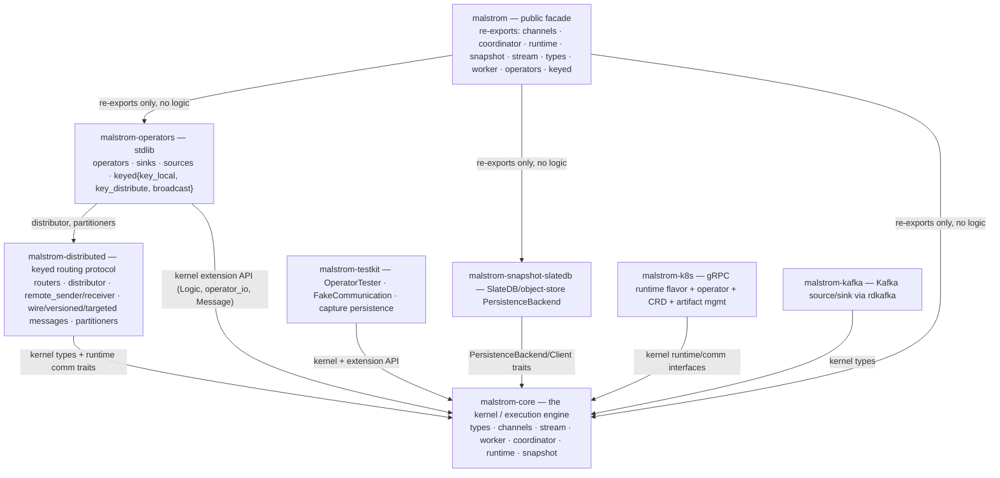
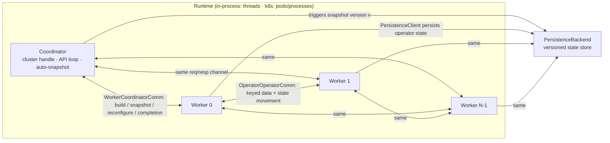
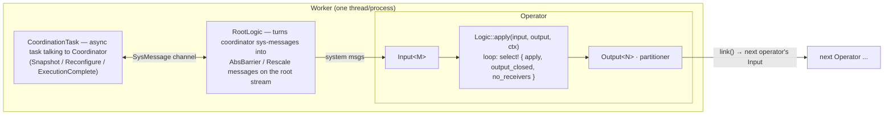
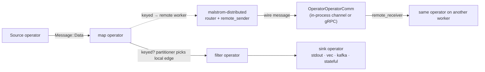

# Malstrom — Architecture at a Glance

> **Last refreshed:** 2026-09-03

> **Scope:** distilled high-level architecture — core entities, crate layering, job anatomy,
> runtime dataflow, and coordination/snapshot flows. Diagrams in mermaid, same style as
> [`04-modules.md`](04-modules.md). Code is the source of truth; paths below are links into it.

## The core idea

> **One job = 1 Coordinator + N identical Workers.**
> Workers run the *same* dataflow program in parallel; a Coordinator orchestrates lifecycle
> (build, snapshot, rescale, suspend). Operators exchange **Messages** through channels;
> state is snapshotted via **barriers that travel in-band inside the message stream** — this
> is what makes processing exactly-once (ABS algorithm, see
> [`snapshot/mod.rs`](../../malstrom-core/src/snapshot/mod.rs)).

## Core entities

| Entity | Code | Role |
|---|---|---|
| `Kvt` trait | `malstrom-core/src/types/message.rs` | Bundles `Key/Value/Timestamp` type params into one bound — the generic "shape" of every stream |
| `Message` / `DataMessage` | `malstrom-core/src/types/message.rs` | The unit flowing through the graph. `Data` = records; `Epoch` = watermark; `AbsBarrier` = snapshot trigger; `Rescale`/`ReconfigComplete` = scaling; `Interrogate`/`Collect`/`Acquire` = key-state movement |
| `Input` / `Output` / `link` | `malstrom-core/src/channels/operator_io.rs` | Edges of the dataflow graph. **Same-worker** communication only; `Output` holds a partitioner + SPSC senders |
| `Operator` + `Logic` | `malstrom-core/src/stream/operator.rs`, `operator_logic.rs` | One processing step. `Logic::apply(input, output, ctx)` is scheduled repeatedly by the worker. `SafeLogic` is the safer variant (`on_data`, `on_epoch`, `on_barrier`, `on_rescale`, `on_interrogate`, `on_collect`, `on_acquire`) |
| `StreamBuilder` / `StreamProvider` | `malstrom-core/src/stream/stream_builder.rs`, `worker/stream_provider.rs` | The declarative API: `provider.new_stream().source(..).map(..).sink(..)` chains operators via `Malstrom::then` |
| `Worker` | `malstrom-core/src/worker/worker.rs` | Unit of parallelism. Builds the dataflow, runs operator tasks, hosts the `CoordinationTask` (talks to the coordinator) |
| `Coordinator` | `malstrom-core/src/coordinator/coordinator.rs` | Exactly one per job. Runs `coordinator_loop`: `StartBuild` → `StartExecution` → serve API requests (Snapshot / Scale / Suspend) |
| `Runtime` | `malstrom-core/src/runtime/` | Spawns coordinator + workers, provides the **communication backends** (`OperatorOperatorComm` worker↔worker, `WorkerCoordinatorComm` worker↔coordinator). Flavors: single-thread, multi-thread (in-process), k8s (gRPC) |
| `PersistenceBackend` / `SnapshotBarrier` | `malstrom-core/src/snapshot/mod.rs` | Versioned state store + the barrier that rides inside `Message` and flushes state when it drains through the graph |

## Crate layering (who depends on whom)

The workspace is a deliberately **layered, acyclic** set of crates; `malstrom` is a thin facade
with no logic of its own (`malstrom/src/lib.rs` is a re-export tree).



Layer order inside the kernel (`malstrom-core/src/`): `types` (foundation) → `channels` +
`snapshot` (primitives) → `stream` (assembly API — the seam where `Logic`'s IO meets channels,
distributed messages and barriers) → `runtime` + `worker` + `coordinator` (execution core).

## Job anatomy at runtime



- The **runtime** owns both actors: it constructs the coordinator and spawns `parallelism`
  identical workers (`MultiThreadRuntime::execute`, `malstrom-core/src/runtime/threaded/multi.rs`).
- Each **worker** runs the *entire* dataflow; the message key decides *which* worker processes
  a record (`malstrom-distributed` routes it there).
- The **coordinator** never sees data records — only control traffic.

## Inside one worker (the operator execution loop)



- `Operator::start` runs the loop `logic.apply(..)` with `tokio::select!` on the output's
  closed signal (`malstrom-core/src/stream/operator.rs`); a source operator is just a `Logic`
  with no input that emits on every schedule.
- `CoordinationTask` receives `RuntimeMessage::{Snapshot, Reconfigure, ExecutionComplete}` from
  the coordinator and forwards them as `SysMessage`s; `RootLogic`
  (`malstrom-core/src/worker/root_logic.rs`) injects them into the dataflow **in-band** as
  `Message::AbsBarrier(..)` / `Message::Rescale(..)`.

## The message path: local vs remote



- **Local routing** (`channels`): an `Output` holds SPSC senders + an `OperatorPartitioner`;
  `link()` wires output→input. System messages (`Epoch`, barriers, rescale) are *broadcast* to
  every edge; data is partitioned.
- **Remote routing** (`malstrom-distributed`): a three-stage pipeline per operator —
  `input_recv` (local + remote messages in) → state-handler (ICA key-distribution algorithm,
  buffers collected keys) → `output_send` (chooses `routers/{normal, collect, interrogate,
  upgrading}` → wire message to a remote worker, or plain local send).
- `malstrom-core/src/runtime/communication/` is the pluggable seam: the threaded flavor
  (`runtime/threaded/communication/`) uses inter-thread channels; `malstrom-k8s/runtime`
  implements the same two traits (`OperatorOperatorComm`, `WorkerCoordinatorComm`) over gRPC —
  the same job code runs both ways.

## Snapshot / rescale coordination (exactly-once)

```mermaid
sequenceDiagram
    participant U as User / CoordinatorApi
    participant C as Coordinator
    participant W as Worker (CoordinationTask)
    participant R as RootLogic
    participant O as Operators
    participant P as Persistence

    U->>C: snapshot() / rescale(n)
    C->>W: RuntimeMessage::Snapshot(v) / Reconfigure(set, v)
    W->>R: SysMessage (creates SnapshotBarrier / RescaleMessage)
    R->>O: Message::AbsBarrier / Message::Rescale (in-band!)
    O->>O: each operator persists its state / moves keys
    O->>P: PersistenceClient::persist(operator_id, state)
    Note over O: barrier clones align in channels; when the last clone drops, callback fires
    W-->>C: respond(true) → coordinator commits version v
```

## Worth knowing

- **Everything is a `Message`** — data *and* control (barriers, rescale, state movement) ride
  the same channels. Snapshotting is woven into the data stream itself, so a worker's state can
  never be inconsistent with what it processed; the last barrier dropping is the completion
  signal (`SnapshotBarrier::drop` → callback).
- **No async / lifetimes / `Send` in user code** — the ergonomics barrier is inside
  `Logic`/`SafeLogic`; serialization (`rmp-serde`) is only required at process boundaries
  (`types/distributable.rs`, `snapshot::serialize_state`).
- `docs/overviews/02-branch-new-scheduler.md` describes an older, monolithic layout that did
  not compile; the current branch (post crate-split) supersedes it — prefer this doc and
  [`04-modules.md`](04-modules.md).
