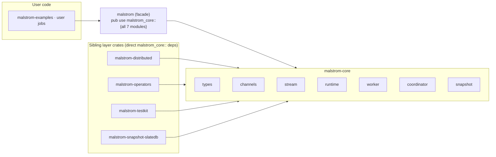
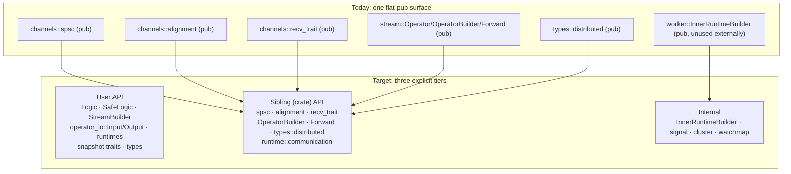

> **Last refreshed:** 2026-09-21

# The `malstrom-core` public API surface

This doc inventories what `malstrom-core` exposes, who actually uses each part, and where
the surface can be **hidden** to reach better abstractions. It is an audit, not a decision —
see "Recommended hide list" for the concrete, landable steps.

Conventions: link to code, don't duplicate it. Counts are from a `grep`-based scan
(2026-09-21) and are approximate; the module tables are the source of truth for *shape*, the
counts only for *scale*.

## Two audiences, one surface

`malstrom-core` has exactly two kinds of consumer, and the current `pub` tree does not
distinguish them:

1. **End users**, via the `malstrom` facade (`malstrom/src/lib.rs`), which does
   `pub use malstrom_core::{channels, coordinator, runtime, snapshot, stream, types, worker}` —
   i.e. it re-exports **every core module verbatim**. A user importing `malstrom::…` therefore
   sees the *entire* core surface, including machinery that exists only for the sibling crates.
2. **The sibling layer crates** — `malstrom-distributed`, `malstrom-operators`,
   `malstrom-testkit`, `malstrom-snapshot-slatedb` — which each `use malstrom_core::…`
   directly and reach into deep module paths.

The problem: **the facade re-exports the sibling-facing surface too.** Everything a layer
crate needs is automatically visible to end users.

## Module inventory and intended audience

For each core module: what it is, and whether its `pub` items are meant for **users**, for
**sibling crates**, or are **internal-only** (no external consumer — the hideable set).

| Module | Public shape | External consumers | Intended audience |
|---|---|---|---|
| `types` | re-exports `Data`/`Key`/`Time`/`Kvt`/`Message`/…; submodules `distributable`, `distributed` | all siblings + users | **users** (model types) — but `distributed` is sibling-only |
| `stream` | `Logic`, `SafeLogic`, `LogicBuilder`, `OperatorContext`, `StreamBuilder`, `OperatorBuilder`, `Operator`, `Forward`, `BuildContext`, `Malstrom` | users + operators/distributed | **split**: `Logic`/`SafeLogic`/`StreamBuilder` are user API; `OperatorBuilder`/`Forward`/`Operator` are implementation |
| `channels` | `operator_io` (`Input`/`Output`/`link`/`full_broadcast`), `spsc`, `alignment`, `recv_trait`, `signal`(crate) | users (via custom operators) + distributed | **mixed**: `operator_io::Input`/`Output` user-facing; `spsc`/`alignment`/`recv_trait` are edge internals |
| `runtime` | `SingleThreadRuntime`, `MultiThreadRuntime`, `RuntimeFlavor`, `communication::*` | users (`SingleThreadRuntime`) + distributed (comm traits) | **mixed**: runtimes are user API; `communication` mostly sibling-only |
| `worker` | `WorkerBuilder`, `InnerRuntimeBuilder`, `Worker`, `StreamProvider` | users (`StreamProvider`) + core-only builder | **mixed**: `StreamProvider` user API; `InnerRuntimeBuilder` internal |
| `coordinator` | `Coordinator`, `CoordinatorApi`, error types | users (rare) | **users** (public control API) |
| `snapshot` | `PersistenceBackend`/`Client`, `NoPersistence`, `SnapshotBarrier`, `serialize_state` | users (backends) + siblings | **users** (extension point) |

## Who pulls what (the real internal contract)

A `grep` of `malstrom_core::…` usage in the sibling crates gives the *de facto* internal API —
everything here must stay reachable to them (though not necessarily `pub` to users):

| Core path | distributed | operators | testkit | slatedb | Note |
|---|:--:|:--:|:--:|:--:|---|
| `channels::operator_io::{Input,Output}` | ● | ● | ● | | user API too (custom operators) |
| `channels::operator_io::link` | ● | ● | | | edge wiring; arguably internal |
| `channels::operator_io::full_broadcast` | ● | | | | partitioner primitive |
| `channels::spsc` | ● | | | | **edge internals** |
| `channels::alignment` | ● | | | | **edge internals** |
| `channels::recv_trait` | ● | ● | | | **edge internals** |
| `stream::{Logic,SafeLogic}` | | ● | ● | | user extension API |
| `stream::{Operator,OperatorBuilder,Forward}` | | ● | | | **implementation** (see below) |
| `stream::BuildContext` | ● | ● | | | mostly build plumbing |
| `stream::StreamBuilder` | | ● | ● | | user API |
| `types::*` | ● | ● | ● | ● | user API |
| `types::distributed` | ● | ● | | | **wire protocol**, sibling-only |
| `types::distributable` | ● | ● | | ● | user-boundable trait |
| `runtime::{SingleThreadRuntime,communication}` | ● | ● | ● | ● | runtimes user; comm sibling |
| `worker::{StreamProvider,Worker,Builder}` | | ● | ● | ● | `StreamProvider` user; builder internal |
| `snapshot::*` | | ● | ● | ● | user API (backend extension) |

`InnerRuntimeBuilder` appears in **no** sibling crate — it is constructed and consumed only
inside `malstrom-core` (`worker/builder.rs`, `stream/stream_builder.rs`). That is the clearest
hide candidate.

## Where the abstraction is weakest

Six concrete smells, each with the offending exposure:

1. **`Operator` exposes its internals as fields.**
   `stream/operator.rs` has `pub input: Input<M>` and `pub output: Output<N>`. Every combinator
   (`union`, `split`) manipulated these directly until `OperatorBuilder` was added; the fields
   are still `pub`, so the encapsulation is convention-only. `swap_input`/`link_to_input` exist
   as named replacements but do not remove the fields.

2. **`operator_io::{Output,Input}` leak a low-level channel type in a constructor.**
   `Output::add_another_one(&mut self, tx: spsc::Sender<Message<M>>)` and
   `Input::add_another_one(&mut self, rx: spsc::Receiver<Message<M>>)` — public methods whose
   parameters are the **edge internal** `spsc` types. Their only caller is `link`
   (`operator_io.rs`), which is itself a wiring helper. A user never needs these; `spsc`,
   `alignment`, and `recv_trait` are edge internals exposed solely so siblings can build edge
   plumbing.

3. **`types::distributed` (the keyed state-movement protocol) is public to users.**
   `Acquire`/`Collect`/`Interrogate` are the wire vocabulary of `malstrom-distributed`. They
   ride inside the public `Message` enum (so they must be *nameable*, at least via `Message`),
   but the structs themselves are sibling-only.

4. **`Forward` is public.** `stream/forward_logic.rs` is a no-op forwarding `SafeLogic` used by
   `union()`/`split()` to wire edges. It is implementation detail re-exported at
   `malstrom_core::stream::Forward` — and even documented in the operator crates' code. Users
   should never name it.

5. **`OperatorBuilder` is public.** Added in the recent refactor as the way combinators build
   `Operator`s without touching fields. It is the *right* abstraction, but it is plumbing: only
   the operator crates use it. Public exposure means it is now a compatibility surface.

6. **The facade over-exports.** `malstrom` re-exports all seven core modules wholesale, so
   `malstrom::channels::spsc::Receiver`, `malstrom::stream::Forward`,
   `malstrom::channels::alignment::AlignmentGroup`, etc. are all in the user's namespace. The
   examples already reach into `malstrom::channels::operator_io::Output` and
   `malstrom::channels::spsc` — evidence that the deep paths are being used because there is no
   curated surface.

## Exposure ladder (today → target)

Rust gives only two visibilities that help here: `pub` and `pub(crate)`. To express a
**sibling-only** tier the options are:

| Mechanism | How | Cost |
|---|---|---|
| **`pub(crate)` + `#[doc(hidden)]` + `pub` only where needed** | keep items `pub` for the crate graph but `#[doc(hidden)]` so they vanish from docs and stand out as internal | not enforced by the compiler; a user *can* still name them |
| **A feature-gated "internal" façade** | e.g. `#[cfg(feature = "internal-api")] pub mod internal { … }`; siblings enable the feature | real enforcement; adds a feature and cfg noise |
| **Move shared internals to a new crate** | `malstrom-core-internal` depended on by core + siblings; nothing re-exported by the facade | strongest boundary; a new crate and a dependency edge |
| **Curate the facade only** | leave core `pub`, but stop the `malstrom` facade re-exporting the internal modules; expose a hand-picked surface | no compiler change; fixes only the *user* view, not core's own surface |

## Recommended hide list (landable, ordered)

Steps are independent. Items 1–4 are **done** (item 4 only for the self-contained cluster —
see below); items 5–6 are partly done / open. See the extraction note
[`malstrom-core-internal-crate`](../../.agents/notes/implemented/architecture/2026-09-21-malstrom-core-internal-crate.md).

1. ~~**`worker::InnerRuntimeBuilder` → `pub(crate)`.**~~ **Done 2026-09-21.** Made `pub(crate)`
   (with `StreamBuilder::runtime` field and the unused `get_runtime` removed); its `pub`
   re-export dropped. No external consumer existed, and it no longer appears in the built
   `malstrom` docs.
2. ~~**`#[doc(hidden)]` on the implementation types**~~ **Done 2026-09-21.**
   `stream::Forward` and `stream::OperatorBuilder` are `#[doc(hidden)]` (with their `stream`
   re-exports); both are used only by `malstrom-operators`. `Operator::input`/`output` are now
   `pub(crate)` (union/split route through `OperatorBuilder` + `swap_input`/`link_to_input`/
   `get_*_mut`), so the operator's internals are no longer part of the public surface.
3. ~~**`Output`/`Input::add_another_one`**~~ **Done 2026-09-21.** Both are now
   `pub(crate)` (their only caller is `link` in the same module), so no `spsc` type appears
   in a public signature anymore.
4. ~~**Introduce an explicit internal tier**~~ **Done (in part) 2026-09-21.** The new
   `malstrom-core-internal` crate holds `spsc`, `recv_trait` and `alignment`; core depends on
   it and re-exports them `pub(crate)`, siblings import from it directly, and the facade does
   not expose them. `types::distributed` and `runtime::communication` stayed in core: they
   reference the public extension API (`Message`, `SafeLogic`, `BuildContext`), so moving them
   would invert the dependency — deferred to the edge-unification work.
5. **Curate the `malstrom` facade.** Sizeable progress: the moved edge internals are no longer
   reachable via `malstrom::…`. The remaining `pub use malstrom_core::{… all modules …}` still
   re-exports the coupled items (`stream::Forward`/`OperatorBuilder`, `types::distributed`),
   which are only `#[doc(hidden)]`. A full item-level curation is still open.
6. **Add a public-API snapshot test.** **Open** — not added; `malstrom/tests/namespace.rs`
   (updated for the new surface) is the current regression anchor.

## Open questions

- **Is a separate internal crate worth it?** The strongest boundary, but the sibling crates are
  in-repo; a feature flag may be enough and avoids a new crate.
- **Should `OperatorBuilder` be public long-term?** It is a good abstraction; if it becomes the
  *only* way to build operators, it may deserve first-class user status rather than hiding.
- **Where does `BuildContext` belong?** It is used by siblings and appears in public `Logic`
  signatures; it may be unavoidable user surface.
- **`types::distributed` naming.** It is the keyed state-movement protocol but lives under
  `types`; if it moves to `malstrom-distributed`, `Message` (core) can no longer embed it
  without a cycle — the coupling is why it sits in core and is public.

## How this connects to the rest

- `05-architecture.md` — the crate layering and the facade's role.
- `06-channels.md` — the edge internals (`spsc`, `operator_io`, `alignment`) this audit
  proposes to hide.
- The `fail-loud-on-dangling-operator-edges` and `unify-operator-io-edge-abstractions` Agent
  Notes both touch the edge layer's public shape.
- The `OperatorBuilder`/`Forward` refactor (Agent Note
  `stream-builder-union-refactor`) is what created items 2 and 5.