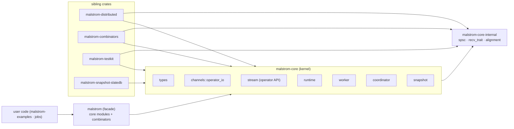

> **Last refreshed:** 2026-09-22

# The public API surface

This doc inventories the crate surface, who consumes each part, and where the boundary between
**users**, **sibling crates**, and **internal** code sits. It began as an audit of
`malstrom-core`; most of its hide list has since landed, so it now records the settled boundary
plus what remains.

Conventions: link to code, don't duplicate it. The module tables are the source of truth for
*shape*.

## The crates and their audiences

| Crate | Role |
|---|---|
| `malstrom` | the user facade — re-exports the kernel modules and the combinator surface |
| `malstrom-core` | the **kernel**: model types, `channels::operator_io`, the stream/operator API (`SafeLogic`, `Operator`, `OperatorBuilder`, `StreamBuilder`), runtimes, worker, coordinator, snapshot |
| `malstrom-core-internal` | a **lower layer**: edge primitives that reference no core type (`spsc`, `recv_trait`, `alignment`); never re-exported by the facade |
| `malstrom-combinators` | the **`StreamBuilder` extension surface** (formerly `malstrom-operators`): `map`/`filter`/`sink`/`source`/`union`/`split`/`cloned`/stateful/time/keyed |
| `malstrom-distributed` | keyed routing protocol |
| `malstrom-testkit` | test utilities |
| `malstrom-snapshot-slatedb` | SlateDB persistence backend |

## Vocabulary: operators vs combinators

- An **operator** is a `Logic`/`SafeLogic` node — a message processor. The **Operator API**
  (`SafeLogic`, `Operator`, `OperatorBuilder`, `StreamBuilder`, `Input`/`Output`, `Message`)
  lives in `malstrom-core`.
- A **combinator** is anything extending `StreamBuilder`/`InitialStreamBuilder` — the
  user-facing DSL. All of it lives in `malstrom-combinators` (see
  [`2026-09-22-combinators-vs-operators`](../../.agents/notes/implemented/architecture/2026-09-22-combinators-vs-operators.md)).

## Module inventory and intended audience

| Module | Public shape | Audience |
|---|---|---|
| `core::types` | `Data`/`Key`/`Time`/`Kvt`/`Message`/…; submodules `distributable`, `distributed` | **users** — `distributed` is the message vocabulary, also public |
| `core::stream` | `Logic`, `SafeLogic`, `LogicBuilder`, `OperatorContext`, `StreamBuilder`, `BuildContext`, `Malstrom`, `Operator`, `DirectLogic`; `Forward`/`OperatorBuilder` are `#[doc(hidden)]` | **users** (extension API) + kernel-owned hidden plumbing |
| `core::channels` | `operator_io` (`Input`/`Output`/`link`/`full_broadcast`) | **users** (custom operators); `signal` is `pub(crate)`; the edge primitives are in `malstrom-core-internal` |
| `core::runtime` | `SingleThreadRuntime`, `MultiThreadRuntime`, `RuntimeFlavor`, `communication::*` | **users** (runtimes) + runtime flavors (`communication` is the extension point) |
| `core::worker` | `WorkerBuilder`, `Worker`, `StreamProvider`; `InnerRuntimeBuilder` is `pub(crate)` | **users** (`StreamProvider`) |
| `core::coordinator` | `Coordinator`, `CoordinatorApi`, error types | **users** (control API) |
| `core::snapshot` | `PersistenceBackend`/`Client`, `NoPersistence`, `SnapshotBarrier`, `serialize_state` | **users** (backend extension) |
| `core-internal` | `spsc`, `recv_trait`, `alignment` | **siblings only** — not in the facade |
| `combinators` | the `StreamBuilder` extension traits + their extension points (`SourceImpl`, `*SinkImpl`, `StatefulLogic`, `TTLState`, …) | **users** |

## The boundary: what is hidden, and how

| Item | Disposition |
|---|---|
| `channels::spsc`, `channels::alignment`, `channels::recv_trait` | moved to **`malstrom-core-internal`** (lower layer; siblings depend on it directly) |
| `worker::InnerRuntimeBuilder` | `pub(crate)` (no external consumer) |
| `Output`/`Input::add_another_one` | `pub(crate)` (only `link` calls them; removed the `spsc` type from a public signature) |
| `Operator::input`/`output` | `pub(crate)` — `OperatorBuilder` + `swap_input`/`link_to_input` are the construction path |
| `stream::OperatorBuilder`, `stream::Forward` | **kernel-owned**, `#[doc(hidden)]` — the abstraction that hides `Operator`'s internals; not moved out |
| `runtime::communication` | **public** — the runtime-flavor extension point (`OperatorOperatorComm`/`WorkerCoordinatorComm`, implemented by `malstrom-k8s/runtime`) |
| `types::distributed` | **public** — the keyed state-movement vocabulary embedded in the public `Message` enum |

Rust offers only `pub`/`pub(crate)`, so "sibling-only" needs one of: `#[doc(hidden)]` (unenforced),
a feature-gated module, or a separate lower crate. The edge primitives took the **crate** route
(`malstrom-core-internal`); the kernel-owned `OperatorBuilder`/`Forward` are `#[doc(hidden)]`.

## Remaining gaps

1. **Facade still re-exports whole modules.** `malstrom` does
   `pub use malstrom_core::{channels, coordinator, runtime, snapshot, stream, types, worker}`, so
   `stream::OperatorBuilder`/`Forward` are nameable (though `#[doc(hidden)]`). Item-level
   curation is optional — they are undocumented kernel abstractions.
2. **No public-API snapshot gate.** `cargo-public-api` (or a `cargo doc` JSON diff) is not wired
   up; `malstrom/tests/namespace.rs` is the current regression anchor.
3. **Combinator sub-modules not folded.** `malstrom-combinators` still exposes `sinks`,
   `sources` and `keyed` as separate facade paths alongside `combinators`, though all are
   `StreamBuilder` extensions by the definition above.

## Open questions

- **Should `OperatorBuilder` be public long-term?** It is a good abstraction; if it becomes the
  only way to build operators, it may deserve first-class user status rather than hiding.
- **`types::distributed` naming.** It is the keyed state-movement protocol but lives under
  `types`; it stays in core because `Message` embeds it (moving it would cycle).
- **Fold `sinks`/`sources`/`keyed` under `combinators`?** Would make the facade match the
  vocabulary, at the cost of more path churn.

## How this connects to the rest

- `05-architecture.md` — crate layering and the facade's role.
- `06-channels.md` — the edge internals (`spsc`, `operator_io`, `alignment`).
- [`2026-09-21-malstrom-core-internal-crate`](../../.agents/notes/proposed/architecture/2026-09-21-malstrom-core-internal-crate.md)
  — the lower-layer boundary (proposed).
- [`2026-09-22-combinators-vs-operators`](../../.agents/notes/implemented/architecture/2026-09-22-combinators-vs-operators.md)
  — the operator/combinator vocabulary and the rename (implemented).
- The `fail-loud-on-dangling-operator-edges` and `unify-operator-io-edge-abstractions` notes
  touch the edge layer's public shape.