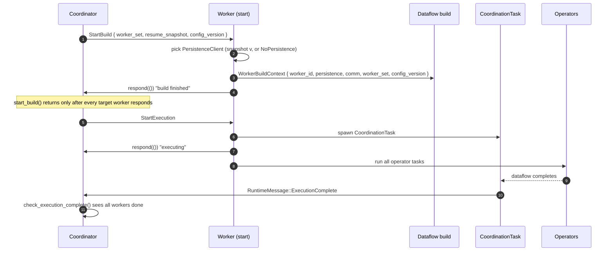

# The StartBuild Protocol

Before a job runs, the coordinator and the workers perform a short, strictly ordered
handshake. It is what lets a job resume from a snapshot, agree on the set of workers, and
build every worker's dataflow with the right configuration. This page walks through that
protocol — the **StartBuild** handshake — as implemented in
`malstrom-core/src/worker/worker.rs` and `malstrom-core/src/coordinator/cluster.rs`.

## Why a handshake at all

A worker cannot build its dataflow in isolation. It needs to know:

- **which workers are in the cluster** — the keyed router must know every peer it may send a
  record to;
- **which snapshot to resume from** — or `None` to start fresh;
- **the config version** — cluster-wide configuration that must match across workers.

The coordinator owns all three and hands them to each worker exactly once at startup. The
build must finish on *every* worker before *any* worker starts processing, so the handshake
is deliberately two-phase: **build**, then **execute**.

## The messages

Three typed messages carry the protocol (`malstrom-core/src/coordinator/messages.rs`):

| Message | Direction | Payload |
|---|---|---|
| `StartBuild(BuildInformation)` | coordinator → worker | `worker_set`, `resume_snapshot`, `config_version` |
| `StartExecution` | coordinator → worker | none (a unit struct) |
| `RuntimeMessage` | worker → coordinator | `Snapshot(v)` · `Reconfigure((worker_set, v))` · `ExecutionComplete` |

`StartBuild` is a tuple struct and `StartExecution` a unit struct; both are pinned by a
round-trip test, because the coordination task decodes exactly these shapes. Sending a
`RuntimeMessage` where a `StartBuild` is expected would mis-decode — which is precisely the
bug that the rescale path once caused.

## The sequence

The two `respond(())` calls are what make the ordering safe:

1. **Build barrier.** `Coordinator::start_build` fans the `StartBuild` message out to every
   target worker and `join_all`s the responses. It returns only once *all* of them have built.
   A worker that cannot build (e.g. a stream was never `.finish()`ed) fails here, before
   execution starts.
2. **Execute gate.** `StartExecution` is sent only after the build barrier passes. The worker
   spawns its `CoordinationTask`, acknowledges, and only then runs the operator tasks.

## What the worker does with `BuildInformation`

Given the payload, the worker (`Worker::execute`) constructs a
`WorkerBuildContext` and broadcasts it to the dataflow builder:

- `resume_snapshot: Some(v)` → a `PersistenceClient` scoped to version `v`
  (`persistence.for_version`); `None` → `NoPersistence`.
- `worker_set` → the peer set the keyed router is built against.
- `config_version` → cluster-wide config that must agree across workers.

The built context is sent over a `broadcast` channel so every operator task can read it
during construction.

## Startup vs rescale

The same messages drive a scale-up. On rescale, the coordinator sends `StartBuild` /
`StartExecution` to **only the newly added workers** — the existing workers already hold a
`WorkerBuildContext` and are told to reconfigure instead
(`RuntimeMessage::Reconfigure((new_set, v))`). Sending `StartBuild` to an already-running
worker would mis-decode at its coordination task, which is the origin of both the startup
mis-decode bug and its regression test.

## Where this lives in the code

| Step | File |
|---|---|
| Protocol types + round-trip test | `malstrom-core/src/coordinator/messages.rs` |
| Coordinator sends `StartBuild` / `StartExecution` | `malstrom-core/src/coordinator/cluster.rs` |
| Coordinator drives startup and the completion poll | `malstrom-core/src/coordinator/coordinator.rs` |
| Worker receives, builds, gates execution | `malstrom-core/src/worker/worker.rs` |
| Runtime messages → system messages | `malstrom-core/src/worker/coordination_task.rs` |